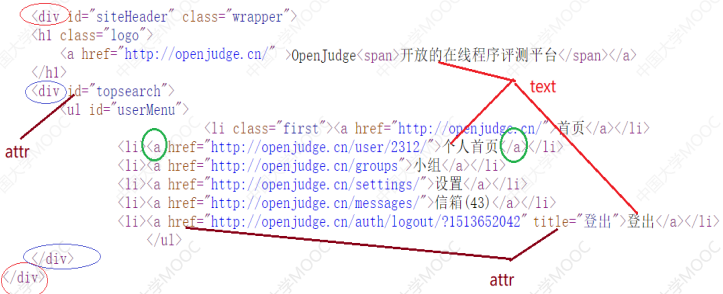
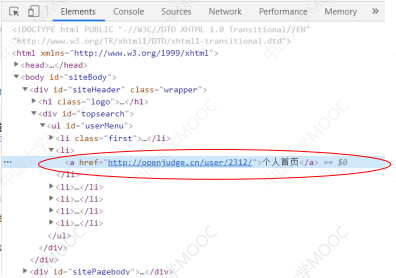
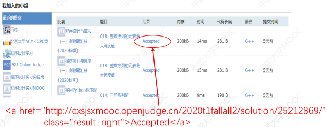
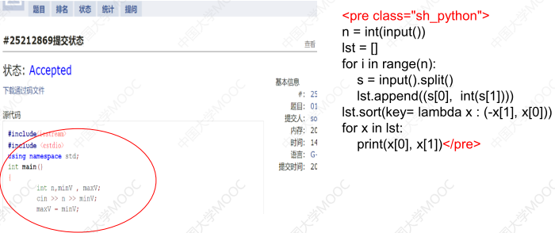
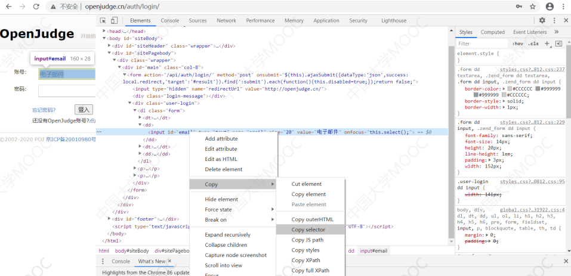

参考: 

15.爬虫.pdf

### 12 网络爬虫设计

12.1 爬虫的基本原理：爬取百度图片搜索结果

12.2 用requests、pyppeteer或selenium获取网页

12.3 用beautifulsoup分析网页

12.4 实例：用pyppeteer爬取每日股票交易信息

12.5 用pyppeteer编写需要登录的爬虫：原理

12.6 用pyppeteer编写需要登录的爬虫：实现

12.7 pyppeteer+requests编写高速爬虫

12.8 爬虫编写注意事项


#### 12.1 爬虫的基本原理：爬取百度图片搜索结果

##### 1 爬虫的用途和原理

1. 网络上搜集数据（比如搜索引擎）
2. 模拟浏览器快速操作（抢票，抢课，抢挂号 .....)
3. 模拟浏览器操作，替代填表等重复操作

##### 2 最基本的爬虫写法

###### 1 数据获取型爬虫的本质

1. 是自动获取网页, 并抽取其的内容

###### 2 爬虫写法

1. 手工找合适的 url （网址）。
2. 用浏览器, 手工查看 url 对应的网页，并查看网页源码，找出想要的内容（文件名，链接等）的字符串的模式。
3. 程序中获取 url 对应的网页。
4. 程序中用 正则表达式 或  BeautifulSoup 库抽取网页中想要的内容并保存。

###### 3 示例：获取百度图片的搜索结果图片

1. 在百度图片敲关键字“desk”进行搜索

2. 搜索后看浏览器地址栏的地址：`
   https://image.baidu.com/search/index?tn=baidu
   image&ipn=r&ct=201326592&cl=2&lm=-1&st=-
   1&fm=index&fr=&hs=0&xthttps=111111&sf=1&fmq=&
   pv=&ic=0&nc=1&z=&se=1&showtab=0&fb=0&width=&h
   eight=&face=0&istype=2&ie=utf-
   8&word=desk&oq=desk&rsp=-1`

3. 猜测: 

   在浏览器输入下面地址，desk替换为猫, 就能搜到图片：
   `https://image.baidu.com/search/index?tn=baidu
   image&ipn=r&ct=201326592&cl=2&lm=-1&st=-1&fm=index&fr=&hs=0&xthttps=111111&sf=1&fmq=&pv=&ic=0&nc=1&z=&se=1&showtab=0&fb=0&width=&height=&face=0&istype=2&ie=utf-8&word=猫`

   复制出来的图片地址(右键 | 复制图片地址 :):

   `https://img1.baidu.com/it/u=716463119,473541077&fm=26&fmt=auto&gp=0.jpg`

   https://img1.baidu.com/it/u=1942928812,1521681685&fm=253&fmt=auto&app=138&f=JPEG?w=889&h=500

   此链接是百度保存的缩略图的网址

   网页源码中的出现 (右键|查看网页源代码)：
   `{"thumbURL":"https://img1.baidu.com/it/u=716463119,473541077&fm=26&fmt=auto&gp=0.jpg",`

4. 用浏览器访问刚才的url,并用浏览器查看源码(chrome)

5. 在源码中查找

   `716463119,473541077&fm=26&fmt=auto&gp=0.jpg`

   发现图片链接在网页里都是这样的：

   `{"thumbURL":"https://img1.baidu.com/it/u=716463119,473541077&fm=26&fmt=auto&gp=0.jpg", "adType":"0","midd ......`

   可以用正则表达式提取图片链接

6. ```
   import re
   import requests  #request库用于获取网络资源 pip install requests
   def getHtml(url):  #获取网址为url的网页
       #具体实现略，后面再讲述
       pass
   def getBaiduPictures(word,n):
       #下载n个百度图片搜来的关于word的图片保存到本地
       url ="https://image.baidu.com/search/index?tn=baiduimage&ipn=r&ct=201326592&cl=2&lm=-1&st=-1&fm=index&fr=&hs=0&xthttps=111111&sf=1&fmq=&pv=&ic=0&nc=1&z=&se=1&showtab=0&fb=0&width=&height=&face=0&istype=2&ie=utf-8&word="
       url += word
       html = getHtml(url)
       pt = '\"thumbURL\":.*?\"(.*?)\"' #正则表达式，用于寻找图片网址i = 0
       #"thumbURL":"https://img1.baidu.com/it/u=716463119,473541077&fm=26&fmt=auto&gp=0.jpg",
   
       for x in re.findall(pt, html): #x就是图片url
           print(x)
           x = x.lower()
           try:
               r = requests.get(x, stream=True)#获取x对应的网络资源
               f = open('{0}{1}.jpg'.format(word,i), "wb")
               #"wb"表示二进制写方式打开文件
               f.write(r.content)    #图片内容写入文件
               f.close()
               i = i + 1
           except Exception as e :
               pass
           if i >= n:
               break
   getBaiduPictures("猫", 5)
   getBaiduPictures("熊猫", 5)
   ```

   

#### 12.2 用requests、pyppeteer或selenium获取网页

##### 1 用 requests.get 获取网页

1. ```
   def getHtml(url):  #获取网址url的网页
       import requests  #request库用于获取网络资源,pip install request
       # 用于伪装浏览器发送请求
       fakeHeaders = {'User-Agent':'Mozilla/5.0 (Windows NT 10.0; Win64; x64) AppleWebKit/537.36 (KHTML, like Gecko) \ ''Chrome/81.0.4044.138 Safari/537.36 Edg/81.0.416.77', 'Accept': 'text/html,application/xhtml+xml,*/*'}
       try:
           r = requests.get(url,headers = fakeHeaders)
           r.encoding = r.apparent_encoding #确保网页编码正确
           return r.text #返回值是个字符串，内含整个网页内容
       except Exception as e: #添加try...except,编码识别加强
           print(e)
       return ""
   ```
   

###### 1 r.text

1. 类型是 str, 字符串

###### 2 r.apparent_encoding

1. 网页的编码

###### 3 r.content

1. 二进制

###### 4 requests 库获取网页的优势和局限

1. 优势
    相比其它方法，速度快几倍

    安装简单，分发容易

2.  局限
    容易被反爬虫手段屏蔽

    不能获取包含javascript生成的动态网页

3. 用上面的getHtml函数，不能得到百度图片搜索结果网页，得到的网页是空网页（被反爬了）

##### 2 其它获取网页的办法

###### 1 selenium库

1. 慢，很容易被反爬
2. 已经被许多网站反爬，网上各种对付反爬的解决办法基本不管用，不推荐

###### 2 pyppeteer库

1. 快，暂未被许多网站反爬，强烈推荐
2. 弥补 requests 不足的


#### selenium 获取网页

##### 1 selenium 环境安装

1. pip install selunium
2. 要chrome浏览器或firefox浏览器，还需要chrome驱动程序
   (chromedriver.exe)或firefox驱动程序(geckodriver.exe)

##### 2 selenium获取网页

1. ```
   def getHtml(url):  #暂时适用于百度图片搜索
       from selenium import webdriver  #需要pip install selenium
       from selenium.webdriver.chrome.options import Options #设置Chrome浏览器选项
       options = Options()  #浏览器选项
       #等价于 options = webdriver.chrome.options.Options()
       options.add_argument('--headless')    #规定chrome浏览器隐身模式运行
       options.add_argument('--disable-gpu') #禁止chrome使用gpu加速，能快点
       
       #创建浏览器driver
       driver = webdriver.Chrome(executable_path='c:/tmp/chromedriver.exe',options=options )
       #driver就是个chrome浏览器。需要下载安装chrome驱动器 chromedriver.exe
       
       driver.get(url) #浏览器装入网页
       html = driver.page_source #网页源代码
       driver.close()   #关闭浏览器
       driver.quit()    #退出
       return html #返回字符串
   ```

##### 3 selenium获取网页原理

1. 用chrome的驱动创建 chrome 浏览器

   driver = webdriver.Chrome(驱动路径)

2. url作get() 参数, 把网页装入driver浏览器中

   driver.get(url)

3. html = driver.page_source #网页源代码放入变量html, 字符串类型

4. driver.close()   #关闭浏览器
   driver.quit()    #退出

   

#### pyppeteer

##### 1 pyppeteer  来历

1. puppeteer 谷歌公司推出的控制 Chrome 浏览器的一套编程工具。
2. 一个日本工程师以此为基础推出了 Python 版本，叫 pyppeteer 。
3. pyppeteer 的官网在： https://pypi.org/project/pyppeteer/

##### 2 pyppeteer 工作原理

1. 启动一个浏览器Chromium，用浏览器装入网页。

   浏览器可以用无头模式（headless)，即隐藏模式启动，也可以显式启动

2. 从浏览器获取网页源代码，若网页有javascript程序，获取到的是javascript被浏览器执行后的网页源代码
3. 可以向浏览器发送命令，模拟用户在浏览器上键盘输入、鼠标点击等操作, 让浏览器转到其它网页
4. selenium原理及功能和pyppeteer一样

###### 1 pyppeteer 与 requests的区别

1. pyppeteer 是 Javascript执行后的网页源码
2. requests 是 JavaScript 执行前的网页源码

##### 3 pyppeteer 环境安装

1. pip install pyppeteer
2. 要求Python版本 >= 3.6 
3. 强烈推荐作为爬虫首选工具!!!

###### 1 必须用特殊版本的谷歌浏览器Chromium

使用方法

1. 方法1

   将 Chromium 压缩包随便解压在哪个文件夹，在程序中指明chrome.exe 的位置

2. 方法2

   将 Chromium 解压到 pyppeteer 的安装文件夹下面。这个文件夹通常类

   似：C:\Users\username\AppData\Local\pyppeteer\pyppeteer\local-

   chromium\588429

   把 username 要换成自己的 windows 用户名， 588429 这里可能是别的数。

   将 Chromium 压缩包里面的 chrome-win32 文件夹整个放在上面那个文件夹里面就行

###### 2 用 pyppeteer获取网页

1. ```
   def getHtml(url): #暂时适用于百度图片搜索
       import asyncio #Python 3.6之后自带的协程库
       import pyppeteer as pyp
       async def asGetHtml(url):  #获取url对应网页的源代码
           browser = await pyp.launch(headless=False)
   
           #启动Chromium,browser即为Chromium浏览器，非隐藏启动
   
           page = await browser.newPage()# 在浏览器中打开一个新页面（标签）
   
           #固定的pyppeteer的反爬措施
           await page.setUserAgent('Mozilla/5.0 (Windows NT 6.1; Win64; x64) AppleWebKit/537.36 (KHTML, like Gecko) Chrome/78.0.3904.70 Safari/537.36') #反反爬措施
           await page.evaluateOnNewDocument('() =>{ Object.defineProperties(navigator, { webdriver:{ get: () => false } }) }' ) #反反爬措施
   
           #用 pyppeteer 获取网页
           await page.goto(url)  # 装入url对应的网页
           text = await page.content()  # page.coutent就是网页源代码字符串
           await browser.close()  # 关闭浏览器
           return text
           #速度大约比用requests.get慢5,6倍
       m = asyncio.ensure_future(asGetHtml(url))  #协程外启动协程
       asyncio.get_event_loop().run_until_complete(m)  #等待协程结束
       return m.result()  #返回的就是asGetHtml的返回值 text
   ```

2. 可以改进程序，只启动一次浏览器，生成一个page对象，以后获取不同网页都用同一个page对象，所有事情完成后才关闭浏览器

###### 3 pyppeteer的使用方法

1. 导包

   import asyncio #Python 3.6之后自带的协程库
   import pyppeteer as pyp

2. 定义协程函数

   async def asGetHtml(url):

   1. 启动浏览器

      browser = await pyp.launch(headless=False) #启动Chromium,browser即为Chromium浏览器，非隐藏启动

   2. 在浏览器中打开一个新页面page

      page = await browser.newPage()# 在浏览器中打开一个新页面（标签）

   3. 设置page的反爬措施: 反爬措施是固定的

      await page.setUserAgent('Mozilla/5.0 (Windows NT 6.1; Win64; x64) AppleWebKit/537.36 (KHTML, like Gecko) Chrome/78.0.3904.70 Safari/537.36') #反反爬措施
      await page.evaluateOnNewDocument('() =>{ Object.defineProperties(navigator, { webdriver:{ get: () => false } }) }' ) #反反爬措施

   4. 用 pyppeteer 获取网页
      await page.goto(url)  # 装入url对应的网页

   5. 获取网页源代码字符串

      text = await page.content()  # page.coutent就是网页源代码字符串

   6. 关闭浏览器

      await browser.close()  # 关闭浏览器

3. 协程外启动协程

   m = asyncio.ensure_future(asGetHtml(url))  #协程外启动协程

4. 等待协程结束

   asyncio.get_event_loop().run_until_complete(m)  #等待协程结束

###### 4 launch的参数

browser = await launch(headless=False, executablePath = "c:/tmp/chrome-win32/chrome.exe", userdataDir = "c:/tmp")

1. excutablePath:  如果Chromium没有安装在默认文件夹下面，则需要指定其位置

2. userdataDir: 指明用来存放浏览器工作期间存放临时文件的文件夹。

   不是必须，能防止可能出现的莫名其妙的错误

##### 4 协程

1. 协程 是 定义时加了 async 的函数.

   async 是异步, python3.6开始有

2. 协程是一种特殊的函数，多个协程可以并行

3. pyppeteer 中的所有函数都是协程，调用时都要加 await ，且只能在协程中调用

4. 用协程，忘了加 await 导致错误：

   RuntimeWarning: coroutine 'XXXX' was never awaited

###### async

1. 协程是定义时加了 'async' 的函数 ( Python 3.6 开始有 )

   ```
   async def f()
   	return 0
   ```

###### await

1. 调用协程时，函数名前加 'await'
   `await f()`

#### 12.3 用beautifulsoup分析网页

##### 1 提取网页内容的三种方式

1. 正则表达式(速度最快，但适应变化略差)
2. BeautifulSoup库 (速度是正则表达式的约几分之一)
3. selenium 或 pyppeteer中的浏览器对象的 查找元素函数
   (速度是正则表达式的约百分之一，用在需要模拟在网页中进
   行输入，点击按钮等操作的时候)

##### 2 html 文档 ( 网页 ) 中的 tag

1. 

###### 1 tag格式

`<X attr1='xxx' attr2='yyy' attr3='zzz' ...>nnnnnnnnnnnnnn</X>`  #这一整个是tag

1. 少数没有 正文和`</X>`
2. X : tag的名字(name)
3. attr1,attr2… :  tag的属性（attr）,  =后面跟着属性的值
4. nnnnnnnnnnnnnn : tag的正文（text）

###### 2 tag示例

`<a href="www.sohu.com" id='mylink'>搜狐网</a>`

1. a ： tag的名字(name)
2. href, id : tag的属性(attr)，=后面跟着属性的值
3. 搜狐网 : tag的正文(text)

###### 3 tag 嵌套

1. ```
   <div id="siteHeader" class="wrapper">
   	<h1 class="logo">
   	<div id="topsearch">
   		<ul id="userMenu">
   		<li ><a href="http://openjudge.cn/">首页</a></li>
   	</div>
   </div>
   ```

##### 4 用 BeautifulSoup 库分析 html

###### 1 安装:

1. pip install beautifulsoup4

###### 2 导入：

1. import bs4

###### 3 使用:

1. 将html文档装入一个BeautifulSoup对象X

2. 用X对象的 find, find_all 等函数找想要的tag对象

3. 找到的tag对象，还可以用其 find , find_all 函数找它内部包含（嵌套）的tag对象

4. tag对象的 text 是该对象里的正文（text）

   tag对象也可以看作是一个字典，里面包含各种属性(attr)及其值。

##### 4 把 html 文档载入 BeautifulSoup 对象

###### 1 方法1: html文档来自字符串

1. ```
   str='''
   <div id="siteHeader" class="wrapper">
   	<h1 class="logo">
   	<div id="topsearch">
   		<ul id="userMenu">
   		<li ><a href="http://openjudge.cn/">首页</a></li>
   	</div>
   </div>
   '''
   #带href的 `<a>` 是链接，上面“首页”是链接文字 ,href后面http://openjudge.cn 是链接地址
   soup = bs4.BeautifulSoup(str, "html.parser")
   print('soup', type(soup)) #soup <class 'bs4.BeautifulSoup'>
   
   print(soup.find("li").text) #首页
   div1 = soup.find("div")
   print('div1', type(div1)) #div1 <class 'bs4.element.Tag'>
   li = div1.find("li") #li <class 'bs4.element.Tag'>
   print('li', type(li))
   print(li.find("a").text) #首页
   ```

###### 2 方法2: html文档来自于文件

1. ```
   soup = bs4.BeautifulSoup( open("c:\\tmp\\test.html","r",encoding="utf-8"),
   "html.parser")
   ```

###### 3 方法3: html文档来源于给定网址

1. ```
   import requests
   def getHtml(url):
       #获得html文本
       try:
           r = requests.get(url)
           r.raise_for_status()
           r.encoding = r.apparent_encoding
           return r.text
       except:
           return ""
   
   html = getHtml("https://cn.bing.com/dict/search?q=new")
   soup = bs4.BeautifulSoup(html,'html.parser')
   ```


###### 4 总结: find, find_all() 返回值类型

find

1. bs4.BeautifulSoup()  的返回值类型是 bs4.BeautifulSoup

2. find() 的返回值类型是 bs4.element.Tag
3. 他们有find, find_all() 函数

find_all()

1. 返回值类型是: <class 'bs4.element.ResultSet'>

##### 5 用 BeautifulSoup 对象寻找想要的 tag

1. test.html

   ```
   <!DOCTYPE HTML>
   <html>
   <body>
   <div id="synoid" style="display:block;">
       <div class="df_div2">
           <div class="de_title1">adj.</div>
           <div class="col_fl">
               <a h="ID=Dictionary,5237.1" href="https://cn.bing.com/dict/search?q=novel">
                   <span class="p1-4">novel</span>
               </a>
               <p>
                   <a h="ID=Dictionary,5238.1" href="https://cn.bing.com/dict/search?q=newfangled">
                       <span class="p1-4">newfangled</span>
                   </a>
               </p>
           </div>
       <a href="http://www.baidu.com" id="searchlink1" class="sh1">百度</a>
       <a href="http://www.google.com" id="searchlink1" class="sh2">谷歌</a>
       </div>
   </div>
   </body>
   </html>

2. test1.py

   ```
   import bs4
   soup = bs4.BeautifulSoup(open("test.html",encoding = "utf-8"),"html.parser")
   diva = soup.find("div",attrs={"id":"synoid"})
   #寻找名为"div"，且值为"synoid"的属性"id"的tag
   if diva != None:  #如果找到
       print('diva.find_all', diva.find_all("span",attrs={"class":"p1-4"}))
       print(type(diva.find_all("span", attrs={"class": "p1-4"})))
       for x in diva.find_all("span",attrs={"class":"p1-4"}):
           print(x.text)  #在diva内部继续找
       for x in diva.find_all("a",attrs={"id":"searchlink1"}):
           print(x.text)
       x = diva.find("a",attrs={"id":"searchlink1","class":"sh2"})
       if x != None:
           print(x.text)
           print(x["href"])
           print(x["id"])
   ```

###### 1 用 BeautifulSoup 对象寻找想要的 tag的方法:

find(标签名, attrs)

1. 参数: 

   标签名

   attrs 是字典, 键是属性名, 值是属性值

2. diva = soup.find("div",attrs={"id":"synoid"})
   diva.find("a",attrs={"id":"searchlink1","class":"sh2"})

3. 返回一个<class 'bs4.element.Tag'>类型的字符串

find_all(标签名, attrs)

1. 参数: 

   标签名

   attrs 是字典, 键是属性名, 值是属性值

2. diva.find_all("span",attrs={"class":"p1-4"})

3. 返回一个 <class 'bs4.element.ResultSet'> 类型的列表

tag的属性值的获取

1. x.text
2. x['href']
3. x['id']


#### 12.4 实例：用pyppeteer爬取每日股票交易信息

##### 1 查看页面源代码和F12(检查)的区别

###### 1 查看源代码 : 是原始代码

服务器发送到浏览器的原封不动的代码，也就是最原始的代码。

###### 2 检查 : 是 源代码 + js渲染

1. 源代码中找不到的代码，是浏览器执行js动态生成的。

###### 3 对js的数据爬取**两种方法**：

1. 不能像普通爬虫一样
2. 通过selenum, pyppeteer等自动化技术
3. 在页面上进行[抓包](https://so.csdn.net/so/search?q=抓包&spm=1001.2101.3001.7020)，获取js链接以及表单元素进行请求

##### 2 pyppeteer爬取有js的页面, 用re获取信息

###### 1 网页分析结论

1. 页面查看源代码, 看不到12.17, 12.51等交易数据. 说明源代码里面包含javascript程序, 浏览器执行javascript程序后, 才能得到显示的页面.
2. python程序得到网页后, 还要执行javascript程序, 才能得到股票数据. 用request.get无法得到显示的页面. 必须用 selenium 或 pyppeteer

###### 2 pyppeteer爬取js程序, 用re获取股票名称和代码

1. ```
   import re
   import asyncio  # Python 3.6之后自带的协程库
   import pyppeteer as pyp
   import bs4
   async def antiAntiCrawler(page): #为page添加反反爬虫手段
       await page.setUserAgent('Mozilla/5.0 (Windows NT 6.1; Win64; x64) AppleWebKit/537.36 (KHTML, like Gecko) Chrome/78.0.3904.70 Safari/537.36')
       await page.evaluateOnNewDocument('() =>{ Object.defineProperties(navigator, { webdriver:{ get: () => false } }) }')
   
   #用正则表达式获取股票名称和代码
   async def getStockCodes(page):
       #从"www.banban.cn/gupiao/list_sh.html"对应的page获取所有股票名称和代码
       codes = []
       #最终内容：["四川路桥(600039)","包钢股份(600010)"......]
       html = await page.content()
       pt = '<a href="/gupiao/[^"]*">([^<]*\(\d+\))</a>'
       #对应 <li><a href="/gupiao/600151/">航天机电(600151)</a></li>
       for x in re.findall(pt,html):
           codes.append(x)
       return codes
   #耗时：0: 00:00.033943
   
   async def getStockInfo(url):
       browser = await pyp.launch(headless=False) #启动Chromium,browser即为Chromium浏览器，非隐藏启动
   
       page = await browser.newPage()  #在浏览器中打开一个新页面（标签）
       await antiAntiCrawler(page) #新页面生成后一律调用此来反反爬
       await page.goto(url)  # 页面中装入url对应的网页
       codes = await getStockCodes(page)
       for x in codes[:3]: #只取前三个股票信息
           print("-----",x) #x形如 "四川路桥(600039)"
           pos1, pos2 = x.index("("), x.index(")")
           code =x[pos1 + 1:pos2] #取股票代码,如600039
           url = "https://quote.eastmoney.com/sh" + code + ".html"
           await page.goto(url)
           html = await page.content() #往下编程前可以先print(html)看一看
           # print(html)
   
           pt = '<td>([^<]*)</td>.*?<td[^>]*id="gt\d*?"[^>]*>([^<]*)</td>'
           for x in re.findall(pt,html,re.DOTALL):
               print(x[0],x[1])
       await browser.close()  #关闭浏览器
   url = "http://www.banban.cn/gupiao/list_sh.html"
   loop = asyncio.get_event_loop()
   loop.run_until_complete(getStockInfo(url))
   ```

###### 3 pyppeteer爬取js页面, 用re获取原理

1. 从 `http://www.banban.cn/gupiao/list_cyb.html
   http://www.banban.cn/gupiao/list_sz.html
   http://www.banban.cn/gupiao/list_sh.htm`

   页面爬取有股票名称 股票代码的非js页面

2. 用re.find() 获取股票名称和代码

3. 构建 js 页面的url, 用 pyppeteer 爬虫 url 页面.

   await page.goto(url)  #页面中装入url对应的网页

4. 用 re.find() 获取 信息

##### 3 pyppeteer爬取有js的页面, 用 BeautifulSoup 获取信息

1. 用BeautifulSoup获取股票名称和代码

   ```
   async def getStockCodes(page):
       codes = []
       html = await page.content()
       soup = bs4.BeautifulSoup(html, "html.parser")
       for x in soup.find_all("li"):
       #对应 <li><a href="/gupiao/600151/">航天机电(600151)</a></li>
           a = x.find("a")
           if( "(" in a.text and ")" in a.text):
               codes.append(a.text)
       return codes
   ```

##### 4 pyppeteer爬取有js的页面, 用浏览器自身的查找元素功能获取股票名称和代码

1. ```
   async def getStockCodes(page):
       codes = []
       elements = await page.querySelectorAll("li") #根据tag name找元素
       #对应 <li><a href="/gupiao/600151/">航天机电(600151)</a></li>
       for e in elements:
           a = await e.querySelector("a") #根据tag name找元素
           # obj = await a.getProperty("text") #还可以 a.getProperty("href")
           #上面这句不行就改成:
           obj = await a.getProperty("innerText")
           text = await obj.jsonValue() #固定写法
           if( "(" in text and ")" in text):
               codes.append(text)
       return codes
   ```

###### 1 浏览器自身的查找元素的函数

querySelectorAll(), querySelector(),  getProperty("text"), getProperty("innerText"), jsonValue()

1. elements = await page.querySelectorAll("li") #根据tag name找元素

2. a = await e.querySelector("a") #根据tag name找元素

3. obj = await a.getProperty("text") #这句不行改成:obj = await a.getProperty("innerText")

4. text = await obj.jsonValue() #固定写法

   

#### 12.5 用pyppeteer编写需要登录的爬虫：原理

##### 1 问题

1. 许多网站要登录后才能访问其内容京东、淘宝需要登录才能访问交易记录, openjudge.cn 需要登录才能看提交过的源代码

2. 登录操作，无法用一个url表示出来

3. 解决办法

   方法1：用浏览器模拟登录过程，输入用户名密码、点登录按钮。

   方法2: 程序启动浏览器，等待手工登录后，程序再继续爬虫操作(对有验证码的情况）

   方法3: 不用浏览器, 经数据包分析后, 用 requests库 进行数据传输进行登录.

##### 2 爬取 Openjudge 自己提交通过的所有程序源码

###### 1 分析过程

1. 鼠标右键点击右上角的“个人首页”，弹出的菜单选"检查”:

   

2. 点击“个人首页”, 进入:

   

3. 点击某个题的“Accepted"链接，进入:

   

#### 12.6 用pyppeteer编写需要登录的爬虫：实现

1. ```
   import asyncio
   import pyppeteer as pyp
   async def antiAntiCrawler(page):
       #为page添加反反爬虫手段
       await page.setUserAgent('Mozilla/5.0 (Windows NT 6.1; Win64; x64) AppleWebKit/537.36 (KHTML, like Gecko) Chrome/78.0.3904.70 Safari/537.36')
       await page.evaluateOnNewDocument('() =>{ Object.defineProperties(navigator,{ webdriver:{ get: () => false } }) }')
   
   async def getOjSourceCode(loginUrl):
       width, height = 1400, 800  #网页宽高
       browser = await pyp.launch(headless=False,userdataDir = "c:/tmp",args=[f'--window-size={width},{height}'])
       page = await browser.newPage()
       await antiAntiCrawler(page)
       await page.setViewport({'width': width, 'height': height})
       await page.goto(loginUrl)
   
       #自动登录.#若手动登录，则以下若干行可以去掉
       element = await page.querySelector("#email") #找到账户输入框
       await element.type("XXXXX@pku.edu.cn")  # 输入邮箱
       element = await page.querySelector("#password") #找到密码输入框
       await element.type("XXXXXXXXX")  # 输入密码
   
       element = await page.querySelector("#main > form > div.user-login >p:nth-child(2) > button") #找到登录按钮
       await element.click()  # 点击登录按钮
       #若手动登录，则以上若干行可以去掉
   
       await page.waitForSelector("#main>h2",timeout=30000) #等待“正在进行的比赛...."标题出现
       element = await page.querySelector("#userMenu>li:nth-child(2)>a")
       #找"个人首页”链接
       await element.click()       #点击个人首页链接
       await page.waitForNavigation()  #等新网页装入完毕
       elements = await page.querySelectorAll(".result-right")    #找所有"Accepted"链接, 其有属性 class="result-right"
       page2 = await browser.newPage() #新开一个页面 (标签)
       await antiAntiCrawler(page2)
   
       for element in elements[:2]: #只打印前两个程序
           obj = await element.getProperty("href") #获取href属性
           url = await obj.jsonValue()
           await page2.goto(url)      #在新页面(标签)中装入新网页
           element = await page2.querySelector("pre") #查找pre tag
           obj = await element.getProperty("innerText") #取源代码
           text = await obj.jsonValue()
           print(text)
           print("-------------------------")
           await browser.close()
   def main():
       url = "http://openjudge.cn/auth/login/"
       asyncio.get_event_loop().run_until_complete(getOjSourceCode(url))
   main()
   ```

2. 获取tag的selector
   得到selector: #email

   

   

###### 1 用到的函数总结

setUserAgent(), evaluateOnNewDocument(), 

1. 为page添加反反爬虫手段
   await page.setUserAgent()
   await page.evaluateOnNewDocument()

2. browser = await pyp.launch(headless,args)  #创建浏览器

3. page = await browser.newPage() #创建浏览器的新标签页

4. await page.setViewport({'width': , 'height': })  #设置视口大小

5. await page.goto(loginUrl) #将url对应页面装入page中

6. 自动登录函数

   element = await page.querySelector("#email") #找到账户输入框

   await element.type("XXXXX@pku.edu.cn")  # 输入邮箱

   element = await page.querySelector("#password") #找密码输入框

   await element.type("XXXXXXXXX")  # 输入密码

   element = await page.querySelector("#main > form > div.user-login >p:nth-child(2) > button") #找登录按钮

   await element.click()  # 点击登录按钮

7. 等待页面出现

   await page.waitForSelector("#main>h2",timeout=30000) #等待“正在进行的比赛...."标题出现

   element = await page.querySelector("#userMenu>li:nth-child(2)>a")

8. 找"个人首页”链接

   await element.click()       #点击个人首页链接

   await page.waitForNavigation()  #等新网页装入完毕

   elements = await page.querySelectorAll(".result-right")    #找所有 "Accepted" 链接, 其有属性 class="result-right"

   page2 = await browser.newPage() #新开一个页面 (标签)

   await antiAntiCrawler(page2)

9. 获取想要的信息

   obj = await element.getProperty("href") #获取href属性

   url = await obj.jsonValue()

   await page2.goto(url)      #在新页面(标签)中装入新网页

   element = await page2.querySelector("pre") #查找pre tag

   obj = await element.getProperty("innerText") #取源代码

   text = await obj.jsonValue()

10. 关闭浏览器

    await browser.close()

11. main()中循环

    url = "http://openjudge.cn/auth/login/"
    asyncio.get_event_loop().run_until_complete(getOjSourceCode(url))


#### 

#### 12.7 pyppeteer+requests编写高速爬虫

##### 1 pyppeteer与requests对比

1. requests 对付登录比较麻烦（要用到抓包等技巧）
2. pyppeteer没有requests快(因为要浏览器渲染网页)
3. 对要登录，且登录后的网页不是javascript生成的动态网页的情况，可用pyppeteer登录后，再用requests做剩下的事情。

##### 2 cookie 和 session

###### 1 问题? 

同样的访问请求，服务器怎么知道浏览器是否登录过？

###### 2 cookie和session

1. 登录成功后，服务器向浏览器发送一些身份标识数据，称为cookie，浏览器以后每次向服务器发送请求，都带上cookie，服务器就能知道请求来自前面那个登录的浏览器了。
2. 服务器在内存为浏览器维护一个session，每个浏览器对应各自的session，里面存放着该浏览器的状态（比如一系列的填表等步骤已经进行到什么程度），不同的session有不同的session id，浏览器发送请求的时候，如果带上session id,服务器也能知道是哪个浏览器在请求。
3. 在客户计算机上由cookie可以生成标识同一个浏览器的session

##### 3 pyppeteer+requests 编写快速爬虫

###### 1 工作原理

1. pyppeteer的浏览器的页面有 cookies() 函数, 获得cookie

   ```
   cookies = await page.cookies() #cookies是一个列表，每个元素都是一个字典
   
   cookies1 = {}
   
   for cookie in cookies:  # requests中的cookies只要 "name"属性
       cookies1[cookie['name']] = cookie['value']

2. requests.Session() 生成一个空 session

   `session = requests.Session()`

3. session的 cookies.update(cookies) 函数根据 cookies生成相应session

   `session.cookies.update(cookies1)`

4. session的 get(url) 函数，向服务器发送带session的请求

   `result = session.get(url,headers = fakeHeaders)`

###### 2 pyppeteer+requests工作原理的总结: 

1. 获得cookie，生成相应session以后，爬取网页都用session的get函数进行(前提：网页不是javascript生成的。如果是，依然用pyppeteer的浏览器爬取）

###### 3 代码

1. ```
   import asyncio
   import pyppeteer as pyp
   import bs4
   import requests
   def sessionGetHtml(session,url): #发送带session的网页请求
       fakeHeaders = {'User-Agent':'Mozilla/5.0 (Windows NT 10.0; Win64; x64) AppleWebKit/537.36 (KHTML, like Gecko) Chrome/81.0.4044.138 Safari/537.36 Edg/81.0.416.77'}  # 伪装浏览器用的请求头
       try:
           result = session.get(url,headers = fakeHeaders)
           result.encoding = result.apparent_encoding
           return result.text
       except Exception as e:
           print(e)
           return ""
   
   async def makeSession(page):
       #返回一个session,将其内部cookies修改成pypeteer浏览器页面对象中的cookies
       cookies = await page.cookies() #cookies是一个列表，每个元素都是一个字典
       cookies1 = {}
       for cookie in cookies:  # requests中的cookies只要 "name"属性
           cookies1[cookie['name']] = cookie['value']
       session = requests.Session()
       session.cookies.update(cookies1)
       return session
   
   async def antiAntiCrawler(page):
       #为page添加反反爬虫手段
       await page.setUserAgent('Mozilla/5.0 (Windows NT 6.1; Win64; x64) AppleWebKit/537.36 (KHTML, like Gecko) Chrome/78.0.3904.70 Safari/537.36')
       await page.evaluateOnNewDocument('() =>{ Object.defineProperties(navigator,{ webdriver:{ get: () => false } }) }')
   
   async def getOjSourceCode(loginUrl):
       width, height = 1400, 800  #网页宽高
       browser = await pyp.launch(headless=False, userdataDir = "c:/tmp", args=[f'--window-size={width},{height}'])
       page = await browser.newPage()
       await antiAntiCrawler(page)
       await page.setViewport({'width': width, 'height': height})
       await page.goto(loginUrl)
       await page.waitForSelector("#main>h2", timeout=30000) #等待手动登录后，“正在进行的比赛...."标题出现
       element = await page.querySelector("#userMenu>li:nth-child(2)>a")
       #找"个人首页”链接
       await element.click()       #点击个人首页链接
       await page.waitForNavigation()  #等新网页装入完毕
   
       elements = await page.querySelectorAll(".result-right")
       #找所有"Accepted"链接, 其有属性 class="result-right"
       session = await makeSession(page)
       for element in elements[:2]:
           obj = await element.getProperty("href")
           url = await obj.jsonValue()
           html = sessionGetHtml(session, url)
           soup = bs4.BeautifulSoup(html, "html.parser")
           element = soup.find("pre")
           print(element.text)
           print("-------------------------")
       await browser.close()
   def main():
       url = "http://openjudge.cn/auth/login/"
       asyncio.get_event_loop().run_until_complete(getOjSourceCode(url))
   main()
   ```

   

#### 12.8 爬虫编写注意事项

##### 1 绝对网址和相对网址

1. 以http://  或 https:// 开头
2. 相对网址无这两种开头

###### 1 示例

1. 如果当前网页网址是：
   `http://www.pku.edu.cn/education/index.htm`
2. 该网页中有一个链接，其中网址是相对的，形如：`<a href="dict/word.htm">词典单词</a>`
3. 该链接的真实网址（绝对网址）是：
   `http://www.pku.edu.cn/education/dict/word.htm`


###### 2 使用requests库，获得当前网页网址

1. ```
   r = requests.get("http://openjudge.cn")
   print(r.url) #>>http://openjudge.cn
   ```

2. 或

   ```
   session = requests.session()
   r = session.get("http://openjudge.cn")
   print(r.url)
   ```

   

###### 3 用pyppeteer库，获得当前网页网址:

1. ```
   browser = await pyp.launch(headless=False)
   page = await browser.newPage()
   await page.goto("http://openjudge.cn")
   print(page.url) #>>http://openjudge.cn


##### 2 反反爬技巧

1. 连续的两个操作之间，加入适当延时，模拟人的动作，以免因动作太快被识破

2. ```
   import time
   time.sleep(2)  #暂停2秒，啥也不做
   ```

3. 也可以用time.sleep(...) 等待一段时间，确保网页加载完成

