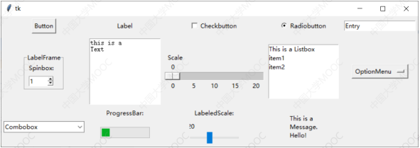
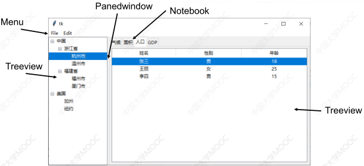
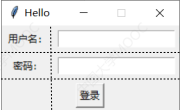
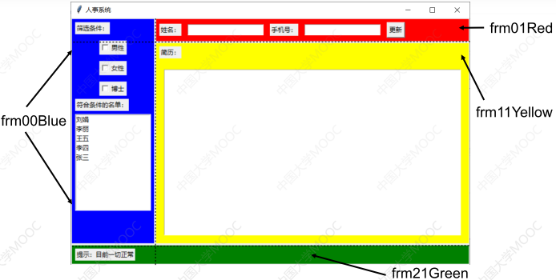
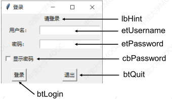
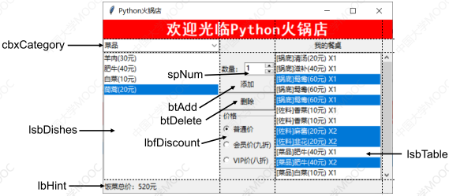
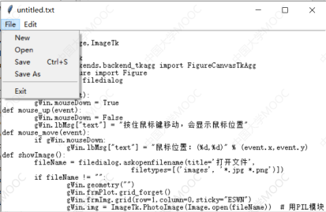
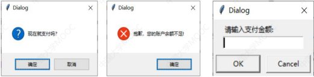
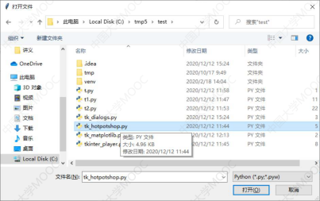
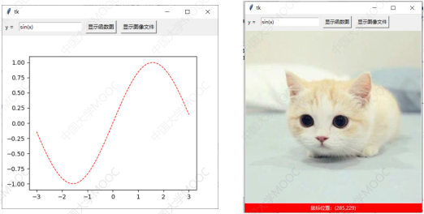

参考资料:  17. python GUI图形界面编程.pdf

### 14 tkinter图形界面程序设计

14.1 控件概述

14.2 布局基础

14.3 使用Frame进行复杂布局

14.4 控件属性和事件响应

14.5 实例：Python火锅店点菜系统

14.6 实例：通过简单文本编辑器掌握菜单和多行编辑框

14.7 对话框

13.8 实例：在图形界面上显示图像、用matplotlib绘图


#### 14.1 控件概述

##### 1 图形界面编程要点

###### 1 tkinter 与 PyQt

1. 使用Python自带tkinter库，简单，但是简陋

2. 使用PyQt，精美，但是难学

##### 2 界面元素

###### 1 控件(widgets)

1. 按钮、列表框、单选框、多选框、编辑框......

###### 2 布局

1. 如何将控件摆放在窗口上合适的位置

###### 3 事件响应

1. 对鼠标点击、键盘敲击、控件被点击等操作进行响应

###### 4 对话框

1. 弹出一个和用户交互的 窗口 , 接受一些输入

##### 3 tkinter控件

###### 1 tkinter的控件

1. | 控件        | 描述                                                         |
   | ----------- | ------------------------------------------------------------ |
   | Button      | 按钮                                                         |
   | Canvas      | 画布，显示图形如线条或文本                                   |
   | Checkbutton | 多选框(方形)                                                 |
   | Entry       | 单行编辑框(输入框)                                           |
   | Frame       | 框架，上面可以摆放多个控件                                   |
   | Label       | 标签 ，可以显示文本和图像                                    |
   | Listbox     | 列表框                                                       |
   | Menubutton  | 带菜单的按钮                                                 |
   | Menu        | 菜单                                                         |
   | Message     | 消息，显示多行文本                                           |
   | OptionMenu  | 带下拉菜单的按钮                                             |
   | Radiobutton | 单选框(圆形)                                                 |
   | Scale       | 滑块标尺，可以做一定范围内的数值选择                         |
   | Scrollbar   | 卷滚条，使内容在显示区域内上下滚动                           |
   | Text        | 多行编辑框（输入框）                                         |
   | Toplevel    | 顶层窗口，可以用于弹出自定义对话框                           |
   | Spinbox     | 微调输入框。可以输入数值，也可以用上下箭头微调数值           |
   | PanedWindow | 滑动分割窗口。可以将一个窗口分成几块，交界处可以拖动，改变各块大小 |
   | LabelFrame  | 带文字标签的框架，上面可以摆放多个控件                       |
   |             |                                                              |
   |             |                                                              |

###### 2 创建窗口和控件

1. ```
   import tkinter as tk
   win = tk.Tk()       #生成一个窗口
   tk.Label(win,.....) #在窗口win上生成一个Label，该Label的母体是win
   ckb = tk.Checkbutton(win,.....) #在窗口上生成一个Checkbutton
   frm = tk.Frame(win,.....) #在窗口上生成一个Frame
   bt = tk.Button(frm,......) #在frm上生成一个Button
   ```

   控件必须用 grid() 布局后, 指定位置, 否则看不到
   
2. 第一个参数是母体对象名

##### 4 tkinter的扩展控件

###### 1 ttk有tk的所有控件

1. `from tkinter import ttk`
2. 更美观，用法基本和tk一样，且ttk多出几个控件

###### 2 tkinter 的扩展控件

1. | 控件         | 描述             |
   | ------------ | ---------------- |
   | TreeView     | 树形列表         |
   | ProgressBar  | 进度条           |
   | Notebook     | 多页标签         |
   | LabeledScale | 带文字的滑块标尺 |
   | Panedwindow  | 分栏窗口         |

2. tree = ttk.TreeView(win, ......)

##### 5 控件图形

1. 
2. 

#### 14.2 布局基础

##### 1 grid 布局

###### 1 grid 介绍

1. pack布局, place布局. 略
2. grid布局: 在窗口上布置网格(grid)，控件放在网格单元里面
3. 

###### 2 grid 示例

1. ```
   import tkinter as tk
   win = tk.Tk()           #创建窗口
   win.title("Hello")  #指定窗口标题
   label1 = tk.Label(win,text="用户名：")  #创建属于win上的图文标签控件
   label2 = tk.Label(win,text="密码：")
   etUsername = tk.Entry(win)       #创建属于win的单行编辑框控件，用于输入用户名
   etPassword = tk.Entry(win)       #创建密码编辑框
   label1.grid(row=0,column=0,padx=5,pady=5)
   #label1放在第0行第0列，上下左右都留白5像素
   label2.grid(row=1,column=0,padx=5,pady=5)
   etUsername.grid(row=0,column = 1,padx=5,pady=5) #用户名输入框放在第0行第1列
   etPassword.grid(row=1,column = 1,padx=5,pady=5) #密码输入框放在第1行第1列
   btLogin = tk.Button(win,text="登录")  #创建属于win的按钮控件
   btLogin.grid(row=2,column=0,columnspan=2,padx=5,pady=5)
   #btLogin放在第2行第0列，跨2列
   win.mainloop() #显示窗口
   ```

###### 示例的小结

1. 生成窗口, 控件对象

2. 对象名.grid() 把控件布局到窗口上

   参数: padx, pady 是控件的上下左右的留白

3. win.mainloop()  #显示窗口, 否则不显示窗口

###### 3 默认情况下的grid规则

1. 一个单元格只能放一个控件，控件在单元格中居中摆放。

2. 不同控件高宽可以不同，因此网格不同行可以不一样高，不同列也可以不一样宽。

   但同一行的单元格是一样高的，同一列的单元格也是一样宽的。

3. 一行的高度，以该行中包含最高控件的那个单元格为准。

   单元格的高度，等于该单元格中摆放的控件的高度（控件如果有上下留白，还要加上留白的高度）。

   列宽度也是类似的处理方式。

4. 若不指定窗口的大小和显示位置，则窗口大小和网格的大小一样，即恰好能包裹所有控件；显示位置则由 Python 自行决定。

5. 如果指定了窗口大小，或者用户拖拽窗口边缘将窗口变大，就会发生网格小于窗口大小的情况

6. `win.geometry("800x500+200+100") `       #小写字母 x
   设定窗口宽 800 像素，高 500 ，左上角距离屏幕的原点的距离(200, 100)

7. 可以做到 网格 随着窗口大小变化自动变化，填满窗口，并且控件依然居中显示

   ```
   win.geometry("500x200")
   win.columnconfigure(0,weight = 1) #指定第0列增量分配权重为1
   win.columnconfigure(1,weight = 1)
   
   win.rowconfigure(0,weight = 1) #指定第0行增量分配权重为1
   win.rowconfigure(1,weight = 1)
   win.rowconfigure(2,weight = 1)
   win.mainloop()
   ```

   行列默认增量分配权重为0，

   宽高不会随着窗口大小变化而变化

###### 4 grid()函数的sticky参数

1. sticky 指明控件的“贴边方式”，即是否要贴着单元格的四条边。

   参数可以是个字符串，包含 "E","W","S","N" 四个字符中的一个或多个。 东, 西, 南, 北

2. ```
   label2.grid(row=1,column=0,padx=5,pady=5,sticky="NE") #密码标签靠左上角
   etUsername.grid(row=0,column = 1,padx=5,pady=5,sticky="E") #用户名编辑框靠右
   etPassword.grid(row=1,column = 1,padx=5,pady=5,sticky="EWSN") #密码编辑框占满单元格
   btLogin.grid(row=2,column=0,columnspan=2,padx=5,pady=5,sticky="SW") #登录按钮靠左下
   ```


#### 14.3 使用Frame进行复杂布局

##### 1 使用Frame控件进行布局

###### 1 为什么用 Frame框架 布局

1. 控件多了，算每个控件的行、列、 rowspan,columnspan 很麻烦
2. Frame 控件上面还可以摆放控件，当作底板使用
3. 在 Frame 控件上面设置网格进行 Grid 布局，摆放多个控件

###### 2 Frame控件布局

1. 四个 Frame控件: frm00Blue, frm01Red, frm11Yellow, frm21Green

   

   

###### 3 使用 Frame 控件 示例

1. frm00Blue 在 row=0,column=0,rowspan=2

   frm01Red 在 row=0,column=1

   frm11Yellow 在 row=1,column=1

   frm21Green 在 row=2,column=0

2. ```
   import tkinter as tk
   
   win = tk.Tk()
   win.title('人事系统')
   
   frm01Red = tk.Frame(win,bg="red",highlightthickness=2) #Frame对象frm01Red, win指定父控件,背景红色，边框宽度2
   frm01Red.grid(row=0,column=1,columnspan=2,sticky="WE") #Frame对象frm01Red的进行 grid布局
   tk.Label(frm01Red, text="姓名：").grid(row=0,column=0,padx=6,pady=6) #Label框架放置到Frame控件上, 并grid布局
   tk.Entry(frm01Red).grid(row=0,column=1,padx=6,pady=6)  #frm01Red指定父控件
   tk.Label(frm01Red, text="手机号：").grid(row=0,column=2,padx=6,pady=6)
   tk.Entry(frm01Red).grid(row=0,column=3,padx=6,pady=6)
   tk.Button(frm01Red,text="更新").grid(row=0,column=4,padx=6,pady=6)
   
   frm00Blue = tk.Frame(win, bg="blue",highlightthickness=2) #Frame控件对象frm00Blue
   frm00Blue.grid(row=0,column=0,rowspan=2,sticky="NS")
   tk.Label(frm00Blue,text="筛选条件：").grid( row = 0,padx=6,pady=6,sticky="W")
   tk.Checkbutton(frm00Blue,text="男性").grid( row = 1,padx=6,pady=6)
   tk.Checkbutton(frm00Blue,text="女性").grid( row = 2,padx=6,pady=6)
   tk.Checkbutton(frm00Blue,text="博士").grid( row = 3,padx=6,pady=6)
   tk.Label(frm00Blue,text="符合条件的名单：").grid( row = 4,padx=6,sticky="W")
   
   nameList = tk.Listbox(frm00Blue)  #列表框
   nameList.grid(row=5,padx=6,pady=6)
   for x in ['张三','李四','王五','李丽','刘娟']:
       nameList.insert(tk.END,x)  #将x插入到列表框尾部。
   
   frm21Green = tk.Frame(win, bg='green',highlightthickness=2)
   frm21Green.grid(row=2,column=0,columnspan=2,sticky="WE")
   tk.Label(frm21Green, text="提示：目前一切正常").grid(row=0,padx=6,pady=6)
   
   frm11Yellow = tk.Frame(win, bg='yellow',highlightthickness=2)
   frm11Yellow.grid(row=1,column=1,sticky="NSWE") #要贴住单元格四条边
   frm11Yellow.rowconfigure(1,weight=1) #使得frm11Yellow中第1行高度会自动伸缩
   frm11Yellow.columnconfigure(0, weight=1)
   tk.Label(frm11Yellow,text="简历：").grid(row=0,padx=6,pady=6,sticky="W")
   tk.Text(frm11Yellow).grid(row=1,padx=15,pady=15,sticky="NSWE") # sticky="NSWE"使得该多行编辑框会自动保持填满整个单元格
   
   win.rowconfigure(1, weight=1)
   win.columnconfigure(1, weight=1)
   win.mainloop()
   ```

##### 2 Frame 控件 示例 总结

###### 1 原理过程

1. 创建控件对象, 参数指定父窗口
2. 控件用grid指定布局位置

###### 2 Lable() 控件的参数

1. 第一个参数, 指定父控件名字
2. text 参数 指定控件文本, 要显示的字符串

###### 3 grid() 参数

1. row, column 指定网格号, 默认是0
2. padx, pady, 距离边界的空白像素
3. rowspan, columnspan 指定 跨过的行或列数

###### 4 Listbox() 列表框

1. nameList 是列表框对象, 向它添加值

   `nameList.insert(tk.END, x)`  #将x插入到列表框尾部。

###### 5 tk.Frame() 参数

1. tk.Frame(win,bg="red",highlightthickness=2) #Frame对象frm01Red, win指定父控件,背景红色，边框宽度2

   highlightthickness 指定边框宽度

###### 6  rowconfigure, columnconfigure

1. win.rowconfigure(1, weight=10)
2. win.columnconfigure(1, weight=1)


#### 14.4 控件属性和事件响应

##### 1 控件属性和事件响应概述

###### 1 有的控件, 用函数或字典下标设置或获取属性

1. 有的控件有函数可以用来设置和获取其属性，或以字典下标的形式获取和设置其属性

2. 字典下标, 或 get()

   ```
   lbHint = tk.Label(win,text = "请登录")
   lbHint["text"] = "登录成功!"  #修改lbHint的text文字属性
   txt = tk.Text(win)
   txt.get(0.0, tk.END))  #取全部文字
   ```

###### 2 有的控件必须和变量相关联, 用set(), get()

1. 有的控件必须和一个变量相关联，取变量值或设置变量值，就是取或设置该控件的属性

2. ```
   s = tk.StringVar()  #StringVar() 类型的s变量
   s.set("sin(x)") #设定变量的值
   tk.Entry(win,textvariable = s)
   print(s.get()) #获取变量的值
   ```

3. set(), get()

###### 3 有的控件, 用command参数指定控件的事件响应函数

1. 创建有些控件时，可以用command参数指定控件的事件响应函数

2. ```
   tk.Button(win,text="显示函数图",command = myfunc) #myfunc是函数名
   tk.Checkbox(win,text="显示函数图",command = lambda:print("hello"))
   ```

###### 4 用控件的bind函数指定事件响应函数

1. ```
   lb.bind("<ButtonPress-1>",mouse_down)  #鼠标左键按下事件
   lb.grid(row=2, column=2)
   ```

##### 2 基本的控件属性和事件响应示例

1. 

2. ```
   import tkinter as tk
   def btLogin_click():  #登录按钮的事件响应函数，点击该按钮时被调用
   	    #变量username, password, lbHint, showPassword是已经定义好的变量
       #etPassword 是已经定义好的Entry控件
       
       if username.get()=="pku" and password.get()=="123": #正确的用户名和密码, 变量username, password用get()获取值
           lbHint["text"] = "登录成功!"   #修改lbHint的文字, 控件lbHint已定义好的, 在下面的语句中
           lbHint["fg"] = "black" #文字变成黑色，"fg"表示前景色,"bg"表示背景色
       else:
           username.set("")  #将用户名输入框清空
           password.set("")  #将密码输入框清空
           lbHint["fg"] = "red"  #文字变成红色
           lbHint["text"] =  "用户名密码错误，请重新输入!"
   def cbPassword_click(): #"显示密码"单选框的事件响应函数，点击该单选框时被调用
       if showPassword.get(): #showPassword是和cbPassword绑定的tkinter布尔变量
           etPassword["show"] = "" #使得密码输入框能正常显示密码。Entry有show属性
       else:
           etPassword["show"] = "*"
   
   win = tk.Tk()
   win.title("登录")
   
   username,password = tk.StringVar(),tk.StringVar() #两个字符串类型变量，分别用于关联用户名输入框和密码输入框
   
   showPassword = tk.BooleanVar() #用于关联“显示密码”单选框
   showPassword.set(True)  #使得cbPassowrd开始就是选中状态
   
   lbHint = tk.Label(win,text = "请登录")
   lbHint.grid(row=0,column=0,columnspan=2)
   
   lbUsername = tk.Label(win,text="用户名：")
   lbUsername.grid(row=1,column=0,padx=5,pady=5)
   
   lbPassword = tk.Label(win,text="密码：")
   lbPassword.grid(row=2,column=0,padx=5,pady=5)
   
   etUsername = tk.Entry(win,textvariable = username) #输入框etUsername和变量username关联
   etUsername.grid(row=1,column = 1,padx=5,pady=5)
   
   etPassword = tk.Entry(win,textvariable = password,show="*")#Entry的属性show="*"表示该输入框不论内容是啥，只显示'*'字符，为""则正常显示
   etPassword.grid(row=2,column = 1,padx=5,pady=5)
   
   cbPassword = tk.Checkbutton(win,text="显示密码",variable=showPassword,command=cbPassword_click) #cbPassword关联变量showPassword，其事件响应函数是cbPassword_click，即点击它时会调用 cbPassword_click()
   cbPassword.grid(row=3,column = 0,padx=5,pady=5)
   
   btLogin = tk.Button(win,text="登录",command=btLogin_click) #点击btLogin按钮会执行btLogin_click()
   btLogin.grid(row=4,column=0,pady=5)
   
   btQuit = tk.Button(win,text="退出",command=win.quit) #点击btQuit会执行win.quit()，win.quit()导致窗口关闭，于是整个程序结束
   btQuit.grid(row=4,column=1,pady=5)
   
   win.mainloop()
   ```
   

###### 1 示例总结

1. 定义的函数中用到的变量, 控件是函数外已经定义好的

2. 定义变量, 设置变量值, 获取变量值

   tk.StringVar() #字符串类型变量

   showPassword = tk.BooleanVar() #用于关联“显示密码”单选框, bool类型变量

   showPassword.set(True)

   showPassword.get()

3. 控件与变量关联

   etUsername = tk.Entry(win,textvariable = username) #输入框etUsername和变量username关联

   etPassword = tk.Entry(win,textvariable = password,show="*")#Entry的属性show="*"表示该输入框不论内容是啥，只显示'*'字符，为""则正常显示

4. 控件与函数关联
   btLogin = tk.Button(win,text="登录",command=btLogin_click) #点击btLogin按钮会执行btLogin_click()
   btQuit = tk.Button(win,text="退出",command=win.quit) #点击btQuit会执行win.quit()，win.quit()导致窗口关闭，于是整个程序结束

   

#### 14.5 实例：Python火锅店点菜系统

##### 1 python火锅店实例

1. 界面

#### 14.6 实例：通过简单文本编辑器掌握菜单和多行编辑框

##### 1 菜单和编辑框



#### 14.7 对话框

##### 1 弹出小窗口

1. 作用：弹出小窗口和用户进行交互，或者显示信息

   

##### 2 文件对话框

1. 

##### 3 用于复杂一点的交互

1. 

##### 4 自定义对话框

###### 1 自定义对话框要点

1. 自定义对话框是一个 Toplevel 窗口，控件布局方式、事件响应方式和普通窗口一样

   ```
   dialog = tk.Toplevel(gWin) #gWin是主窗口，创建对话框窗口
   dialog.grab_set() #显示对话框，并独占输入焦点
   ```

2. 关闭自定义对话框：

   `dialog.destroy()`

#### 14.8 实例：在图形界面上显示图像、用matplotlib绘图

##### 2 显示图像和matplotlib绘图

1. 

###### 1 tkinter界面上matplotlib绘图要点

1. 创建一个matplotlib.pyplot.Figure对象fig

2. 在fig对象上用 add_subplot() 创建一个子图ax

3. canvas = FigureCanvasTkAgg(fig, master=win)

   得到一个将 fig 绑定在 win 上面的 FigureCanvasTkAgg 对象canvas。

   win可以是窗口，也可以是Frame,LabelFrame

4. canvas.get_tk_widget().grid(....) 将canvas布局到win的合适位置

5. 子图ax上画完图后，还要cavans.draw()才能刷新显示

###### 2 用Label显示图像要点

1. aLabel.config(image = tkinter.PhotoImage(file='xxx.gif')) 可以显示gif图像

2. 要显示 jpg, png 需要用到 PIL 库里的 Image 和 ImageTk

   from PIL import Image,ImageTk

   img = ImageTk.PhotoImage(Image.open("XXX.jpg"))

   aLabel.config(image=img)

   注意，可能是库有bug，此处img必须不是局部变量，否则可能无法显示图像。

###### 3 两个组件重叠，只显示一个的要点

1. 两个组件可以放在同一个单元格里面。

2. ```
   ctrl.grid_forget()  #可以让ctrl组件消失
   ctrl.grid(....)  #又将其恢复
   ```

###### 4 为Label添加鼠标左键按下、松开和鼠标移动三个事件响应函数

1. ```
   lbImg.bind("<Motion>", mouse_move)
   lbImg.bind("<ButtonPress-1>",mouse_down)
   lbImg.bind("<ButtonRelease-1>", mouse_up)
   ```

#### 