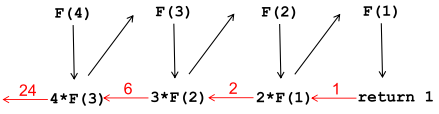
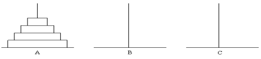
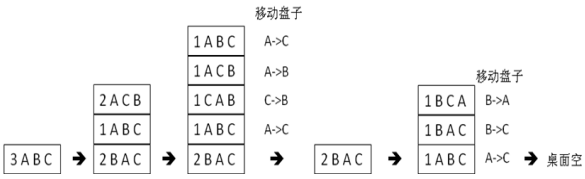
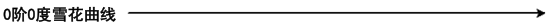
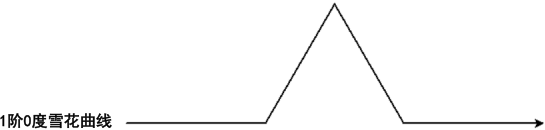
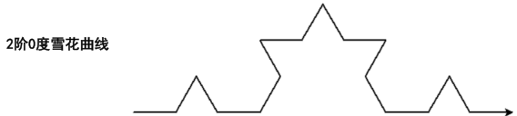
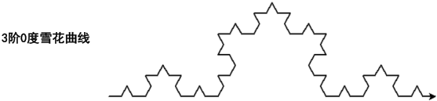

### 4 函数和递归 

4.1 函数的概念和用法

4.2 什么是递归

4.3 递归例题：上台阶

4.4 递归例题：汉诺塔

4.5 递归例题：雪花曲线

4.6 习题边写边说


#### 4.1 函数的概念和用法

##### 1 为什么需要函数

1. 方便
2. 函数: 将实现了某一功能的代码包装起来形成一个功能模块, 在程序中多处使用

##### 2 函数的定义

1. 有参函数

   ```
   def 函数名(参数1, 参数2 ……):
   	语句组(即“函数体”)
   ```

2. 无参函数

   ```
   def 函数名():
   	语句组(即“函数体”)
   ```

##### 3 函数调用和return语句

###### 1 函数调用

1. `函数名(参数1, 参数2, ...)`

###### 2 return语句

1. 函数的调用，是一个表达式。函数调用表达式的值，由函数内部的return语句决定。

2. return语句语法: 

   `return 返回值`

3. 函数没有返回值, return语句直接写：
   `return `

4. return语句的功能: 

   1. 结束函数的执行，并将“返回值”作为结果返回。
      “返回值”是: 常量、变量、表达式均可。
   2. return 语句是函数的出口，可以在函数中多次出现。多个return语句的“返回值”可以不同。
   3. 在哪个return语句结束函数的执行，函数的返回值就和哪个return语句里面的“返回值”相等。

##### 4 函数使用

###### 1 实例1 : Max函数

1. ```
   def Max(x,y):  #形参 x, y
   	if x > y:
   		return x
   	else:
   		return y
   #函数到此结束
   ```

2. ```
   n = Max(4,6)  #实参 4, 6
   ```

###### 2 实例2 : 判断是否是素数的函数

1. ```
   def IsPrime(n):
   	if n <= 1 or n % 2 == 0 and n != 2:
   		return False
   	elif n == 2:
   		return True
   	else:
   		for i in range(3,n,2):
   			if n % i == 0:
   				return False
   			if i * i > n:
   				break
   		return True
   ```

2. ```
   for i in range(100):
   	if( IsPrime(i)):
   		print(i,end = " ")
   ```

##### 5 不返回值的函数

1. ```
   def DrawCircle(x,y,r):
   	#下面的代码在屏幕上以(x,y)点为圆心，r为半径画圆
   	……… 
   	return   #没有也可以
   ```

2. ```
   DrawCircle(0,0,1)
   ```

##### 6 函数返回多个值

1. ```
   def sumAndDifference(x,y):
   	return x+y,x-y
   ```

2. ```
   s,d = sumAndDifference(10,5)
   print(s,d)
   ```

##### 7 函数中的变量

###### 1 函数外与内 同名的变量

1. 函数内定义(赋值)的变量，函数外部不能使用
2. 不同函数中的同名变量不影响
3. 函数中的变量和全局变量(在函数外面定义的变量）同名的情况(假设都叫 x )：
   1) 如果没对 x 赋值，函数中的 x 是全局的 x
   2) 如果对 x 赋值，且没特别声明，则函数中全局的x不起作用，函数中的x只在函数内起作用的 x
   3) 函数内用 global x 声明, x 是全局变量

###### 2 示例

1. ```
   x = 4  #全局的x
   def f0():
   	print("x in f0:",x) #这个x是全局的x
   	
   def f1():
   	x = 8  #这个x是局部的x，不会改变全局的x
   	print("x in f1:",x)
   	
   def f2():
   	global x #说明本函数中的x都是全局的x
   	print("x in f2:",x)
   	x = 5
   	print("x in f2:",x)
   	
   def f3():
   	print("x in f3=",x) #出错。因后面有赋值而被当作局部的x，此处没赋值先使用，不行
   	x = 9
   ```

##### 8 python内置函数

###### 1 内置函数

1. int(x)
2. float(x)
3. str(x)
4. ord(x)
5. chr(x)
6. abs(x)
7. len(x)     len("123") len([2,3,4])
8. max(x)   x 是列表，如 max([2,3,5])
9. min(x)    x 是列表，如 min([2,3,5])
10. max(x1,x2,x3...)
11. min(x1,x2,x3...)

###### 2 示例

1. max(1,2,3)  #3
2. min("ab","cd","af")   #ab


#### 4.2 什么是递归

##### 1 递归

1. 一个概念的定义中用到了这个概念本身，叫递归

###### 1 示例:  用递归的方式定义 "n的阶乘"

1. “1的阶乘”是1

2. “n的阶乘” 是 n 乘以 “(n-1)的阶乘”

   第二句中用到了阶乘这个需要定义的概念

###### 2 递归

1. 一个函数，自己调用自己，就是递归。

   和调用别的函数无本质区别，可看作调用另一个同名同功能函数

2. ```
   def Factorial(n): #函数返回n的阶乘
   	if n < 2 :
   		return 1 # 终止条件
   	else:
   		return n * Factorial(n-1)
   ```

3. print(Factorial(4)) #>>24
   print(Factorial(5))  #>>120

###### 3 递归终止条件

1. 递归函数需要有终止条件，否则会无穷递归导致程序无法终止甚至崩溃
2. 递归定义也要有终止条件，否则无法让人明表。例如 " n的阶乘 " 的定义中的：
   1) “1的阶乘”是1

##### 4 递归的原理

1. ```
   def F(n): #函数返回n的阶乘
   	if n < 2 :
   		return 1; # 终止条件
   	else:
   		return n * F (n-1)
   ```

2. 

3. 每一层调用的 n 的值不同，不会互相影响。

   理解成调用别的同名同功能函数，可很自然理解这一点

##### 5 递归示例

###### 1 求斐波那契数列第 n 项的函数

1. ```
   def Fib(n):
   	if n == 1 or n == 2:
   		return 1
   	else:
   		return Fib(n-1)+Fib(n-2)
   ```

   

#### 4.3 递归例题：上台阶

##### 1 上台阶问题

1. 有n级台阶，每步可以走一级或两级，问有多少种不同的走法

2. ```
   def ways(n):
   	if n == 1:
   		return 1
   	elif n == 2:
   		return 2
   	else:
   		return ways(n-1)+ways(n-2) #第一步走一级的走法+第一步走2级的走法
   print(ways(4)) #>>5
   ```

##### 2 思想:

1. 问题分类. 在某个节点, 变量取某个值, 大问题分为两个小问题.

#### 4.4 递归例题：汉诺塔

##### 1 汉诺塔问题(Hanoi)

1. 古代有一个梵塔，塔内有三个座A、B、C，A座上有64个盘子，盘子大小不等，大的在下，小的在上（如图）。有一个和尚想把这64个盘子从A座移到C座，但每次只能允许移动一个盘子，并且在移动过程中，3个座上的盘子始终保持大盘在下，小盘在上。在移动过程中可以利用B座，要求输出移动的步骤。

2. 

3. ```
   def Hanoi(n, src,mid,dest):
   	#将src座上的n个盘子，以mid座为中转，移动到dest座
   	if( n == 1) : #只需移动一个盘子
   		# 直接将盘子从src移动到dest即可
   		print(src +  "->" + dest)
   		return #递归终止
   	Hanoi(n-1,src,dest,mid)  #先将n-1个盘子从src移动到mid
   	print(src + "->" + dest) #再将一个盘子从src移动到dest
   	Hanoi(n-1,mid,src,dest)  #最后将n-1个盘子从mid移动到dest
   	
   n = int(input())
   Hanoi(n, 'A', 'B', 'C');
   ```

##### 2 汉诺塔问题手工解法(三个盘子）

1. 

#### 4.5 递归例题：雪花曲线

##### 1 绘制雪花曲线（科赫曲线)

###### 1 雪花曲线的递归定义:

1.  长为size，方向为x(x是角度）的0阶雪花曲线，是方向x上一根长为size的线段
2. 长为size,方向为x的n阶雪花曲线，由以下四部分依次拼接组成:
   1. 长为size/3,方向为x的n-1阶雪花曲线
   2. 长为size/3,方向为x+60的n-1阶雪花曲线
   3. 长为size/3,方向为x-60的n-1阶雪花曲线
   4. 长为size/3,方向为x的n-1阶雪花曲线

###### 2 递归绘制雪花曲线（科赫曲线)

1. 
2. 
3. 
4. 

##### 2 绘制雪花曲线

###### 1 雪花曲线编程

1. ```
   import turtle #画图要用这个turtle包
   def snow(n,size): #n是阶数目，size是长度 从当前起点出发，在当前方向画一个长度为size，阶为n的雪花曲线
   	if n == 0:
   		turtle.fd(size) #笔沿着当前方向前进size
   	else:
   		for angle in [0,60,-120,60]: #对列表中的每个元素angle:
   			turtle.left(angle)  #笔左转angle度 , turtle.lt(angle)也可
   			snow(n-1,size/3)
   ```

2. ```
   turtle.setup(800,600)
   #窗口缺省位于屏幕正中间，宽高800*600像素，窗口中央坐标(0,0)
   #初始笔的前进方向是0度。正东方是0度，正北是90度
   
   turtle.penup() #抬起笔
   turtle.goto(-300,-50) #将笔移动到-300,-50位置
   turtle.pendown() #放下笔
   turtle.pensize(3) #笔的粗度是3
   snow(3,600) #绘制长度为600,阶为3的雪花曲线，方向水平
   turtle.done()  #保持绘图窗口
   ```

###### 2 由3段3阶雪花曲线组成

1. ```
   turtle.setup(800,800)
   turtle.speed(1000)
   turtle.penup()
   turtle.goto(-200,100)
   turtle.pendown()
   turtle.pensize(2)
   level = 3
   snow(level,400)
   turtle.right(120) #右拐120度
   snow(level,400)
   turtle.right(120)
   snow(level,400)
   turtle.done()
   ```

2. 

#### 4.6 习题边写边说