### 5 字符串和元组

Python组合数据类型(一): 字符串和元组

5.1 Python变量的指针本质

5.2 字符串的转义字符

5.3 字符串的切片

5.4 字符串的分割

5.5 字符串的函数

5.6 字符串的格式化

5.7 元组

5.8 实例：万年历

5.9 习题边写边说：字符串例题

5.10 习题边写边说：石头剪刀布


#### 5.1 Python变量的指针本质

##### 1 Python 的数据类型

###### 1 基本数据类型

1. int, float, complex

###### 2 组合数据类型

1. 字符串 str
2. 元组 tuple
3. 列表 list
4. 字典 dict
5. 集合 set

类型名 本身是函数名

##### 2 isinstance函数

1.  isinstance (x,y)  #查询数据x是否是类型y

2. ```
   b = (1,3,)
   print(isinstance(b,tuple)) #>>True
   ```

##### 3 len函数

1. len函数, 求组合数据类型的元素个数（长度)

2. ```
   print(len("12345")) #>>5 求字符串长度
   print(len([1,2,3,4]) #>>4 求列表长度
   print(len((1,2,3))) #>>3  求元组长度
   print(len({1,2,3})) #>>3 求集合元素个数
   print(len({'tom':2,'jack':3})) #>>2 求字典元素个数
   ```

##### 4 Python变量的指针本质

###### 1 Python中, 变量都是指针

1. Python中所有可赋值的东西，即可以出现在赋值号"=" 左边的东西，都是指针

2. 指针: 即代表内存单元的地址

3.  将指针称作 “箭头", 更容易理解。所有变量都是箭头，指向内存某处

4. 对变量进行赋值的本质，就是让该变量（箭头）指向某个地方

5. 对变量进行赋值，意味着将变量指向某处

   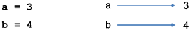

6. 用一个变量对另一个变量赋值意味着让
   两个变量指向同一个地方

   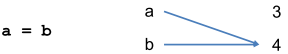

##### 5 is 运算符和 == 的区别

###### 1 is 与 ==

1. a is b  为True,  说a和b 指向同一个地方

   is 地址相同

2. a == b  为True, 说明a和b指向的地方放的的东西相同，但是a和b不一定指向相同的地方

   == 值相同

3. a = b ,使a和b指向同一个地方

4. ```
   a = [1,2,3,4]
   b = [1,2,3,4]
   print( a == b) #>>True
   print( a is b) #>>False
   ```

   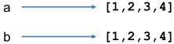

5. ```
   a = [1,2,3,4]
   b = [1,2,3,4]
   print( a == b) #>>True
   print( a is b) #>>False
   c = a
   print( a == c) #>>True
   print( a is c) #>>True
   ```

   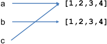

   ```
   a[2] = "ok"
   print(c)  #>>[1, 2, 'ok', 4]
   ```

   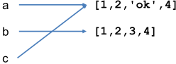

   因为a和c指向同一个地方，所以修改a[2]，c[2]也变。
   a[2]和c[2]是同一个东西

###### 2 int, float, complex, str, tuple 与 list, dict, set

1. int ,float,complex, str,tuple类型的变量a和b，

   只关注 a == b是否成立，关注 a is b是否成立无意义。

   因这些数据本身不更改，不会产生a指向的东西改了b指向的东西也跟着变的情况。

2. list,dict,set类型的变量a和b， 

   a == b和 a is b 结果都要关注。

   因这些数据本身会改变。改变了a指向的内容，说不定b指向的
   内容也变了。

##### 6 列表元素的指针本质

###### 1 列表的元素是指针

1.  列表的元素 可以赋值，因此是指针

###### 2 示例

1. ```
   a = [1,2,3,4]
   b = [1,2,3,4]
   ```

   a[0], a[1]....b[0],b[1] ..... 都是指针

   准确的效果：

   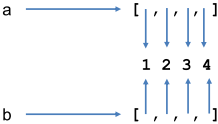

   

2. 执行 b[0],b[2] = 9,4   后, 

   准确的效果：

   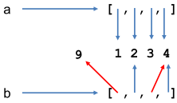

##### 7 函数参数的传递

函数参数也是指针

###### 1 int类型的实参

1.  函数参数传递方式都是传值，即形参是实际参数的一个拷贝。函数参数也是指针。形参和实参指向同一个地方。对形参赋值（让其指向别处）不会影响实参。

2. 示例

   ```
   def Swap(x,y):
   	tmp = x
   	x = y
       y = tmp
       
   a = 4
   b = 5
   Swap(a,b)
   print(a,b) #>>4, 5
   ```

   tmp = x 刚执行完

   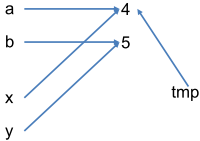

   y = tmp 执行后

   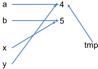

###### 2 list类型的实参

1. 如果函数执行过程中，改变了形参所指向的地方的内容，则实参所指向的地方内容也会被改变。

2. list类型实参示例:

   ```
   def Swap(x,y):
   	tmp = x[0]
   	x[0] = y[0] #x,y是列表，则x[0],y[0],tmp都是指针
   	y[0] = tmp
   	
   a = [4,5]
   b = [6,7]
   Swap(a,b) #进入函数后，x和a指向相同地方，y和b指向相同地方
   print(a,b) #>>[6, 5] [4, 7]
   ```

   进入Swap函数执行完tmp = x[0] 时:

   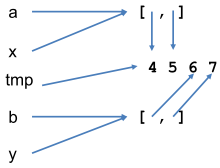

   Swap函数执行完时：

   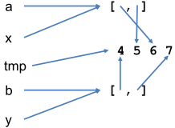

###### 3 总结:

1.  int类型实参和list类型实参是不同的

   int类型实参指向不变, 内容不变

   list类型实参指向不变, 内容会改变

#### 5.2 字符串的转义字符

##### 1 转义字符

1. `\`及其后面的某些字符构成转义字符，即两个字符当一个字符看

2. ```
   print("hello\nworld\tok\"1\\2")  #\n  \t  \" 都是“转义字符”代表换行，制表符, 双引号，斜杠
   ```

3. 字符，包括`\n` 转义字符，只能出现在字符串里，必须用引号括起来！

##### 2 r

1. r 表示字符串里面的\就是\，不会和后面的字符合并起来看待
2. `print(r'ab\ncd')` #>>ab\ncd

#### 5.3 字符串的切片

##### 1  字符串的切片（也叫子串,即连续的一部分）

###### 1 a[x:y] : 

1. 字符串a里从下标x到下标y的子串（不包括下标y的那个字符)

2. ```
   a = "ABCD"
   print (a[1:2]) #>>B   区间是左闭右开，终点不算
   print (a[0:-1]) #>>ABC
   print (a[-3:-1]) #>>BC
   print (a[2:]) #>>CD  终点省略就是一直取到最后一个字符
   print (a[:3]) #>>ABC   起点省略就是从头开始取
   print("abcd"[2:3]) #>>c
   ```

###### 2 a[x:y:z] 

1. 从a[x]取到a[y](a[y]不算），每z个字符取一个，最后拼起来。

2. z为负数则代表倒着取

3. x,y可以省略。x,y全省略表示从头取到尾或从尾取到头

4. ```
   print("1234"[3:1:-1]) #>>43
   print("abcde"[::-1])  #>>edcba   可用于反转字符串
   print("12345678"[1:7:2]) #>>246
   print("12345678"[7:1:-2]) #>>864
   ```

###### 3 字符串切片的用法也适用于元组和列表！

#### 5.4 字符串的分割

##### 1 字符串的 split函数

###### 1 s.split(x)

1. 字符串x做分隔符分割字符串s，得到分隔后的列表

2. 两个相邻分隔符之间会分隔出一个空串

3. ```
   a = "12..34.5346...a"
   print(a.split("..")) #>> ['12', '34.5346', '.a']
   print(a.split("."))   #>> ['12', '', '34', '5346', '', '', 'a']
   print(a.split("34"))  #>> ['12..', '.5', '6...a']
   ```

##### 2 字符串高级分割

###### 1 正则表达式用多个分隔串进行分割

1. import re

   re.split(x,s) :用正则表达式x里面的分隔串分割s

   x里面不同分隔串用"|"隔开，形如:
   `';| |,|\*|\n|\?|ok|8'`

2. 一些特殊字符，如 `? ! " '( ) | * $ \ [ ] ^ { } . `, 在正则表达式里出现时，前面需要加 \

3. ```
   import re
   a = 'Beautiful, is; beoktter*than\nugly'
   print(re.split(';| |,|\*|\n|ok',a)) #分隔串用 | 隔开';' ' ' ','  '*' '\n' 'ok' 都被看作分隔串
   ```

   `#>>['Beautiful', '', 'is', '', 'be', 'tter', 'than', 'ugly']`

4. 两个相邻的分隔串之间，会隔出一个空串

#### 5.5 字符串的函数

##### 1 count   求子串出现次数

1. ```
   s = 'thisAAbb AA'
   s.count('AA')   # 返回2，AA出现2次
   ```

##### 2 len 字符串长度

1. ```
   s = '1234'
   len(s) #4
   ```

##### 3 upper, lower 转大写、小写

1. ```
   s = "abc"
   print(s.upper()) #>> ABC
   print(s) #>> abc
   ```

##### 4 find, rfind, index, rindex

1. 在字符串中找子串，返回位置(下标)。找不到的话，find 
   返回-1, index 引发异常

2. ```
   s="1234abc567abc12"
   print(s.find("ab")) #>> 4 , "ab"第一次出现在下标4
   print(s.rfind("ab")) #>>10
   #find从头开始找，rfind从尾巴开始找。返回第一个找到的位置
   try :
   s.index("afb") #找不到"afb"因此会产生异常
   except Exception as e:
   print(e) #>> substring not found
   ```

3. find 还可以指定查找起点

   ```
   s="1234abc567abc12"
   print(s.find("12",4))  #>>13 指定从下标4处开始查找
   ```

##### 5 replace 替换

1. ```
   s="1234abc567abc12"
   b = s.replace("abc","FGHI") #b由把s里所有abc换成FGHI而得
   print(b) #>> 1234FGHI567FGHI12 
   print(s) #>> 1234abc567abc12
   print(s.replace("abc","")) #>> 123456712
   ```

##### 6 isdigit(), islower(), isupper() 

1. 判断字符串是否是数，是否全是小写等

2. ```
   print("123.4".isdigit())  #>> False
   print("123".isdigit())    #>> True 
   print("a123.4".isdigit()) #>> False
   print("Ab123".islower())  #>> False
   print("ab123".islower())  #>> True

##### 7 startswith, endswith 

1. 判断字符串是否以某子串开头、结尾

2. ```
   print("abcd".startswith("ab")) #>> True
   print("abcd".endswith("bcd")) #>> True
   print("abcd".endswith("bed")) #>> False
   ```

##### 8 strip()  

1. 返回除去头尾空白字符(空格， '\r' '\t'  '\n')后的字符串
2. `print ( " \t12 34 \n ".strip())`  #>>12 34

##### 9 lstrip() 

1. 返回除去头部（左端)空白字符后的字符串
2. `print ( " \t12 34 5".lstrip())`  #>>12 34 5

##### 10 rstrip()

1. 返回除去尾部(右端）空白字符后的字符串

##### 11 strip(s), lstrip(s), rstrip(s)

1. 返回除去两端、左端、右端 在s 中的字符后的字符串

2. ```
   print ( "takeab \n".strip("ba \n"))  #>>take
   #去除两端 'b','a',' ','\n'
   
   print ( "cd\t12 34 5".lstrip("d\tc")) #>>12 34 5
   #去除左端 'd','\t','c'
   ```

   

#### 5.6 字符串的格式化

##### 1 字符串编码

###### 1 字符串的编码在内存中的编码是unicode的

1. 虽然写入文件时可能是gbk或者utf-8的

2. ```
   print (ord("a")) #>>97
   print(ord("好")) #>>22920
   print(chr(22900)) #>>奴
   print(chr(97)) #>>a
   ```

##### 2 字符串格式化

###### 1 format() 

1. ```
   x = "Hello {0} {1:10},you get ${2:0.4f}".format("Mr.","Jack",3.2)
   print(x) #>> Hello Mr. Jack      ,you get $3.2000
   
   x = "Hello {0} {1:>10},you get ${2:0.4f}".format("Mr.","Jack",3.2)
   print(x) #Hello Mr.       Jack,you get $3.2000
   ```

###### 2 {序号：宽度.精度 类型}   

1. 宽度可以是0

2. ````
   > : 右对齐
   < : 左对齐
   ^ : 中对齐
   ````

###### 3 {0:>10.4f} 

1. 第0项是小数
2. 宽度至少是10字符，
3. 右对齐（宽度不足时空格补在左边），
4. 保留小数点后面4位的方式输出

###### 4 占位符 ""中的%s, %d

1. `print("Today is %s.%d." % ('May',21))`   # Today is May.21.


#### 5.7 元组

##### 1 元组

1.  一个元组由数个逗号分隔的值组成,前后可加括号

##### 2 元组不能修改

1. 即不可增删元素，不可对元素赋值，不可修改元素顺序（如排序)

2. ```
   t = 12345, 54321, 'hello!' #t是一个元组
   print(t[0]) #>>12345
   print(t) #>>(12345, 54321, 'hello!')
   
   u = t, (1, 2, 3, 4, 5) #u有两个元素，都是元组
   print(u) #>>((12345, 54321, 'hello!'), (1, 2, 3, 4, 5))
   print(u[0][1])#>>54321
   print(u[1][2])#>>3
   
   t[0] = 88888  #运行错误，元组的元素不能赋值
   ```

##### 3 元组的元素的内容有可能被修改

1. 例如，如果元素是列表，就可以修改该列表

2. ```
   v = ("hello",[1, 2, 3], [3, 2, 1]) # [1，2，3]是列表
   v[1] = 32  #运行错误，元组元素不可修改成指向别的
   v[1][0] = 'world'  #可以
   print(v) #>> ('hello', ['world', 2, 3], [3, 2, 1])
   print(len(v))  #>> 3 求长度
   
   t = [1,2]
   d = (t,t)
   print(d) #>>([1, 2], [1, 2])
   
   t[0] = 'ok'
   print(d) #>>(['ok', 2], ['ok', 2])
   
   t = 8   #t指向了8, 不再指向列表
   print(d) #>>(['ok', 2], ['ok', 2]), d的指向没有变
   ```

##### 4 元组元素的指针本质

###### 1 元组的元素都是指针

1. 元组元素不可修改，是指不可改变元组元素的指向，但是元组元素指向的内容，是有可能被修改的
2. 元组不可修改，类似于组建了一只球队，规定球队人员不可更改，不可加减人，不可修改队员号码。但是队员换个发型，增加体重，受伤缺胳膊少腿了，都是可以的

##### 5 单元素的元组

1. ```
   empty = () #空元组
   singleton = 'hello', #注意末尾的,如果没有，就不是元组而是字符串了
   print(len(empty)) #>>0
   print(len(singleton)) #>>1
   x = ('hello',)  #无逗号则x为字符串
   print(x) #>>('hello',)
   ```

##### 6 下标访问元组，元组切片

1. 用法和字符串一样

2. ```
   tup1 = ('Google', 'Runoob', 1997, 2000)
   tup2 = (1, 2, 3, 4, 5, 6, 7 )
   print (tup1[0]) #>>Google
   print (tup2[1:5])  #>>(2, 3, 4, 5)
   print(tup2[::-1]) #>>(7, 6, 5, 4, 3, 2, 1)
   print(tup2[-1:0:-2]) #>>(7, 5, 3)
   ```

##### 7 元组用 + 连接组合

1. ```
   tup1 = (12, 34.56);
   tup2 = ('abc', 'xyz')
   # 创建一个新的元组
   tup3 = tup1 + tup2
   print (tup3) #>>(12, 34.56, 'abc', 'xyz')
   tup3 += (10,20) # 等价于tup3=tup3+(10,20)，新建了一个元组
   print(tup3) #>>(12, 34.56, 'abc', 'xyz',10,20)
   ```

##### 8 元组运算, 迭代

###### 1 `*` 运算

###### 2 in 迭代

1. ```
   x = (1,2,3) * 3
   print(x) #>>(1, 2, 3, 1, 2, 3, 1, 2, 3)
   print( 3 in (1,2,3))  #>>True
   for i in (1,2,3):
   print(i,end = "")  #>>123
   ```

##### 9 元组赋值

1. ```
   x = (1,2,3)
   b = x
   print(b is x) # true, is 表示两个操作数是否指向同一个东西，即是否是同一个对象
   x += (100,)   # 等价于 x = x + (100,)新建了一个元组
   print (x) # (1, 2, 3, 100)
   print (b) # (1, 2, 3)
   ```

##### 10 元组比大小

1. 两个元组比大小，就是逐个元素比大小，直到分出胜负。

2. 如果有两个对应元素不可比大小，则出 runtime error。

3. ```
   print((1,'a',12 ) < (1,'b',7)) #>>True
   print((1,'a' ) < (1,'a',13)) #>>True
   print((2,'a' ) > (1,'b',13)) #>>True
   print((2,'a' ) < ('ab','b',13))    # runtime error
   ```

##### 11 例题

1. ```
   t = (1,[2,3],4,5)
   接下来以下哪条语句不正确
   
   A t[0] = 2   #A不对, 不可更改指向
   B t = ("a",2,3)
   C t[1][0] = "a"
   D t += (1,2)
   ```

2. ```
   a = [1,2,3]
   b = (a,a)
   b[0][1] = 100
   print(a,b)
   上面程序输出结果是： [1 ,100 ,3] ([1,100,3], [1, 100, 3])
   ```

##### 12 用元组（列表）取代复杂分支结构

###### 1  输入 1-7，输出星期几

1. ```
   weekdays = "Monday","Tuesday","Wednesday","Thursday", \
   "Friday","Saturday","Sunday"
   
   n = int(input())
   
   if  n > 7 or n < 1:
   	print("Illegal")
   else:
   	print(weekdays[n-1])
   ```


#### 5.8 实例：万年历

1. 例题： 已知2012年1月25日是星期三，编写一个程序，输入用“年 月 日”表示的一个2012年1月25日以后的期，输出该日期是星期几(星期天输出0)。

   Sample Input
   2015 11 02
   Sample Output
   1

2. 思路：2012年1月22日是星期天。算出给定日期是从该天起过了x天，然后输出x%7

3. ```
   monthDays = [-1,31,28,31,30,31,30,31,31,30,31,30,31]
   days = 0 #从2012-01-22开始过了多少天
   lst = input().split()
   year,month,date = int(lst[0]),int(lst[1]),int(lst[2])
   for y in range(2012,year):  #先累加过掉的整年的天数
   	if  y%4 ==0 and y%100!= 0 or y%400 == 0: #闰年
   		days += 366
   	else:
   		days += 365
   if year%4 ==0 and year%100!= 0 or year%400 == 0:
   	monthDays[2] = 29
   for i in range(1,month): #再累加year那年过掉的整月的天数
   	days += monthDays[i]
   days += date #累加year年month那个月的天数
   days -= 22  #2012年1月22日是星期天。扣掉2012年的前22天
   print(days % 7)  #星期天算一周的第0天
   ```

4. 下面的方法可以更快算出过掉的整年的总天数，不必逐年累加：

   ```
   days = 0
   days += (year - 2012)*365
   if year > 2012:
   days += (year-2012 - 1)//4 +1  #补上闰年多的一天
   days -= (year – 2000 - 1)//100 - (year – 2000 - 1) // 400
   #扣掉把100的整数倍都当作闰年而多加的天数
   ```

   

#### 5.9 习题边写边说：字符串例题

#### 5.10 习题边写边说：石头剪刀布